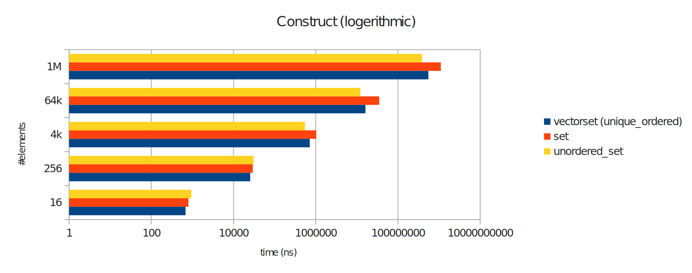
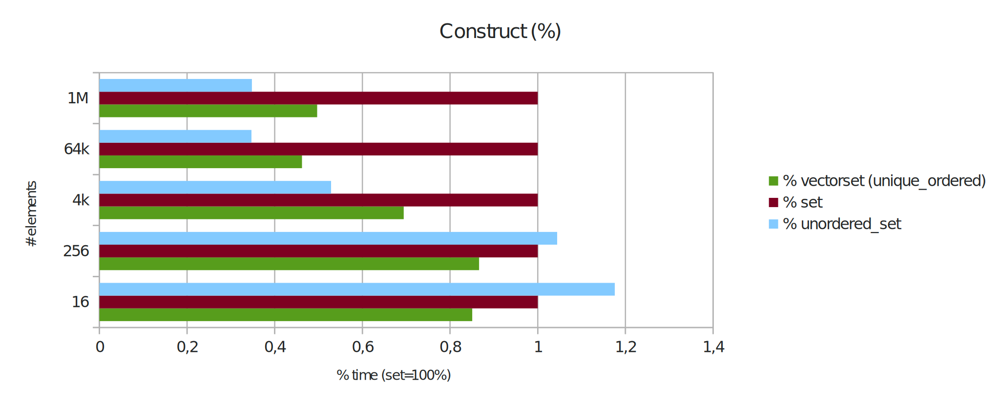
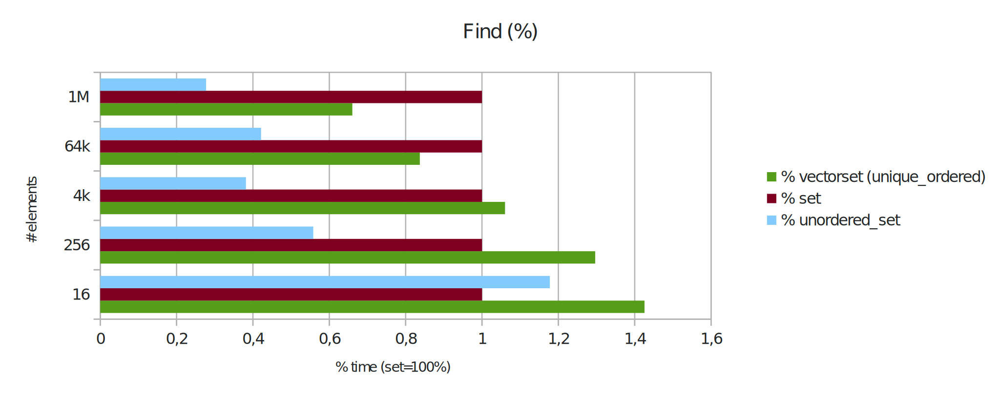
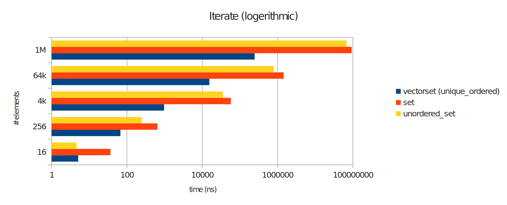
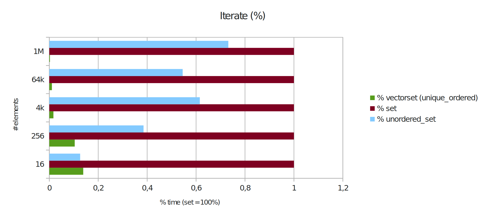
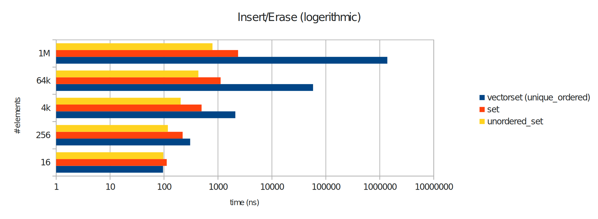
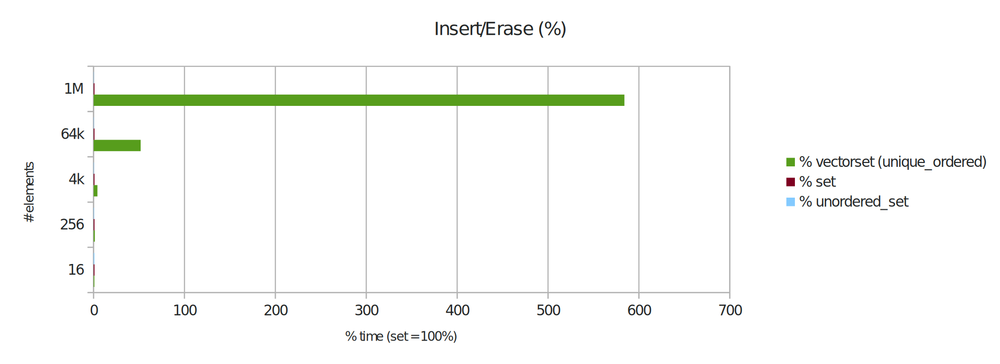

# vectorset container

A container with set interface based on `std::vector`.

The container operates in a unique ordered or an unordered mode. In
unique ordered mode, all elements are sorted and the container behaves
similar to a `std::set`. In unordered mode, the container behaves like
a `std::vector`.

The idea behind this container is to fill the container in unordered
mode and switch to ordered mode when a fast lookup for elements is
needed.

## Installation

Just copy `vectorset.h` into your include path.

If you need a documentation, just start `docygen` in folter `doc` and copy images of folder `README_images` into folder `html`:

    ~/vectorset/doc$ doxygen
    ~/vectorset/doc$ cp -r ../README_images/ html/

## Performance

Pro:
: Fast iterate through the container.

Contra:
: Slow insert and erase operations in unique ordered mode.

### Benchmark: Construct container

Creates a conainer with _n_ elements from `std::vector`. The vectorset
is filled in ounordered mode and then switsched to unique ordered
mode.

**Result:** The `vectorset` is faster than `std::set`. It is also faster
filled than `std::unordered_set` for smaller containers, but slower
than `std::unordered_set` for larger containers.

### Benchmark: Find element in container

Find element in container by key (find-Method). The vectorset is in
unique ordered mode.

**Result:** The `vectorset` is faster than `std::set` with smaller
containers. For larger containers it starts to get faster than
`std::set`. It is always slower than `std::unordered_set`.

### Benchmark: Iterate through container

Iterate through the whole container. The vectorset is in
unique ordered mode.

**Result:** The `vectorset` is significantly faster than `std::set` and
`std::unordered_set`. It is probably as fast as a `std::vector`.

### Benchmark: Insert and erase random element

Erase a random element and insert a new one. The vectorset is in
unique ordered mode.

**Result:** The `vectorset` is significantly slower than `std::set` and
`std::unordered_set`.

