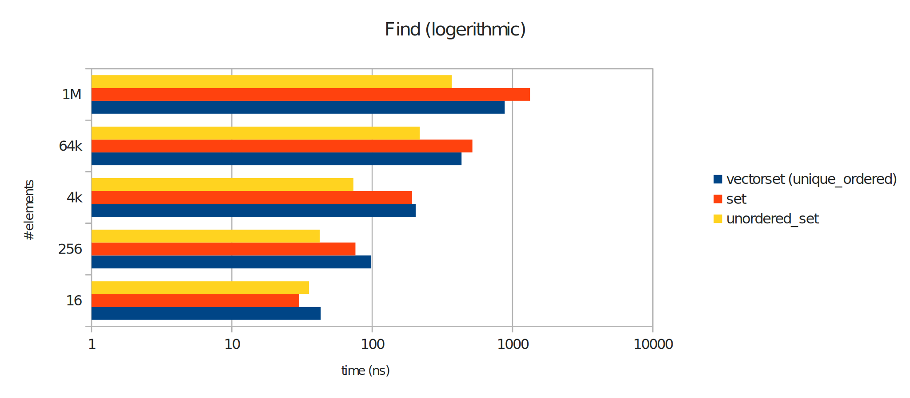

# vectorset container

A container with set interface based on `std::vector`.

The container operates in a unique ordered or an unordered mode. In
unique ordered mode, all elements are sorted and the container behaves
similar to a `std::set`. In unordered mode, the container behaves like
a `std::vector`.

The idea behind this container is to fill the container in unordered
mode and switch to ordered mode when a fast lookup for elements is
needed.

## Installation

Just copy `vectorset.h` into your include path.

If you need a documentation, just start `docygen` in folter `doc` and copy images of folder `README_images` into folder `html`:

    ~/vectorset/doc$ doxygen
    ~/vectorset/doc$ cp -r ../README_images/ html/

## Example

    #include <iostream>
    #include <vectorset.h>

    int main() {
        vectorset<int> values = {5, 3, 1, 0, 2, 5 };

        // standard: unsorted mode (slow find with std::find):
        auto unsortedIter = values.find(2);
        std::cout << "unsorted find pos: "
                  << std::distance(values.begin(), unsortedIter) << '\n';

        // switch to sorted mode (fast find):
        values.set_mode(vectorset_mode::unique_ordered);
        auto sortedIter = values.find(2);
        std::cout << "sorted find pos: "
                  << std::distance(values.begin(), sortedIter) << '\n';

        // duplicate, not inserted:
        std::cout << "sorted size: "
                  << values.size() << '\n';
        values.insert(5);
        std::cout << "sorted size after insert 5: "
                  << values.size() << '\n';

        // slow insert in sorted mode:
        values.insert(6);
        std::cout << "sorted size after insert 6: "
                  << values.size() << '\n';

        // switch back to unsorted mode (fast inserts):
        values.set_mode(vectorset_mode::unordered);

        // fast insert (push_back):
        values.insert({ 5, 6, 7, 8 });
        std::cout << "unsorted size after insert { 5, 6, 7, 8 }: "
                  << values.size() << '\n';

        // switch back to sorted mode again:
        values.set_mode(vectorset_mode::unique_ordered);
        std::cout << "sorted size after switch: "
                  << values.size() << '\n';

        return 0;
    }

Expected outputs:

    unsorted find pos: 4
    sorted find pos: 2
    sorted size: 5
    sorted size after insert 5: 5
    sorted size after insert 6: 6
    unsorted size after insert { 5, 6, 7, 8 }: 10
    sorted size after switch: 8

## Debug mode

Before including `vectorset.h` the macro
`_VECTOR_SET_DEBUG=1` can be defined. In this case all passed
iterators of the class and the index of the square bracket operator
are checked.

Effected methods are:

    iterator insert(const_iterator pos, const value_type& value)
    iterator insert(const_iterator pos, value_type&& value)
    iterator emplace_hint(const_iterator hint, Args&&... args)
    iterator erase(const_iterator pos)
    iterator erase(const_iterator first, const_iterator last)
    reference operator
    const_reference operator

## Performance

Pro:
: Fast iterate through the container.

Contra:
: Slow insert and erase operations in unique ordered mode.

### Benchmark: Construct container

Creates a conainer with _n_ elements from `std::vector`. The vectorset
is filled in ounordered mode and then switsched to unique ordered
mode.

**Result:** The `vectorset` is faster than `std::set`. It is also faster
filled than `std::unordered_set` for smaller containers, but slower
than `std::unordered_set` for larger containers.

### Benchmark: Find element in container

Find element in container by key (find-Method). The vectorset is in
unique ordered mode.

**Result:** The `vectorset` is faster than `std::set` with smaller
containers. For larger containers it starts to get faster than
`std::set`. It is always slower than `std::unordered_set`.

### Benchmark: Iterate through container

Iterate through the whole container. The vectorset is in
unique ordered mode.

**Result:** The `vectorset` is significantly faster than `std::set` and
`std::unordered_set`. It is probably as fast as a `std::vector`.

### Benchmark: Insert and erase random element

Erase a random element and insert a new one. The vectorset is in
unique ordered mode.

**Result:** The `vectorset` is significantly slower than `std::set` and
`std::unordered_set`.

